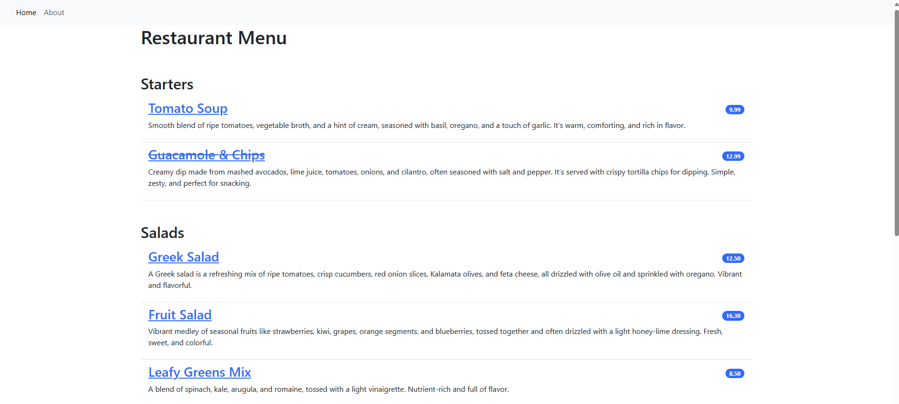
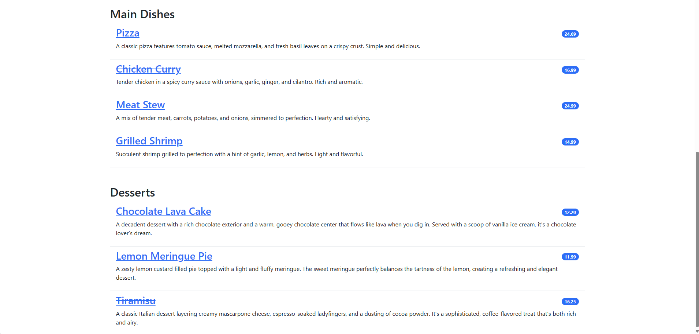
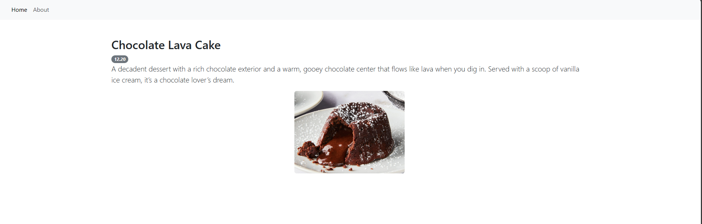
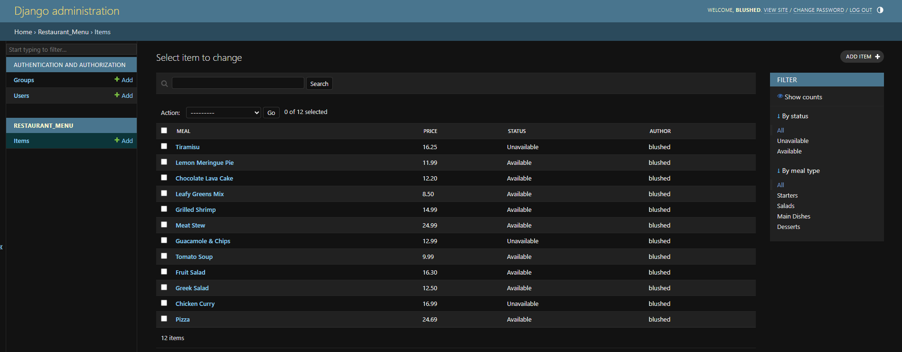
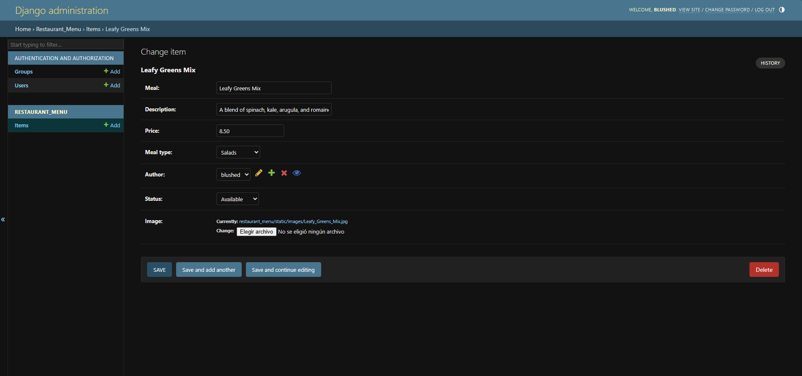

# Restaurant kitchen webapp (Django)

Customers can access the website by scanning a QR code on the web application designed to show them the restaurant menu. This page will show a list of food items organized into categories. You can click on any food item to view a separate webpage with more information and an image of that food item.

Additionally, the Django admin interface allows for the addition, modification, and deletion of food items.

### Screenshots

* Restaurant menu:

  

  
* Page with details of the food item:

  
* Django admin interface:

